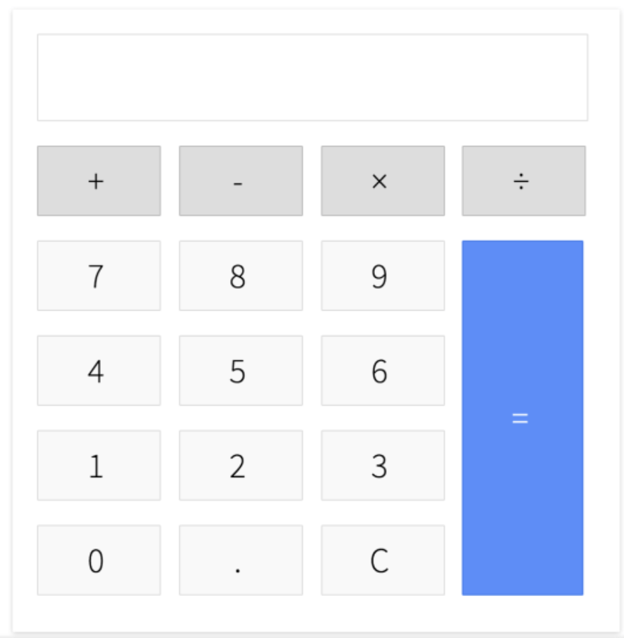

# Javascript Calculator

## Feature
- Additions
- Subtractions
- Multiplications
- Divisions

## After
- What is Javascropt Module Bundler?
- `package.json` 파일에서 scripts 영역의 역할
- `package.json` 파일에서 dependencies vs dev dependencies
- `index.html` 파일에 `<meta charset="UTF-8">`에 대한 조사.. meta tag.. utf-8..?
